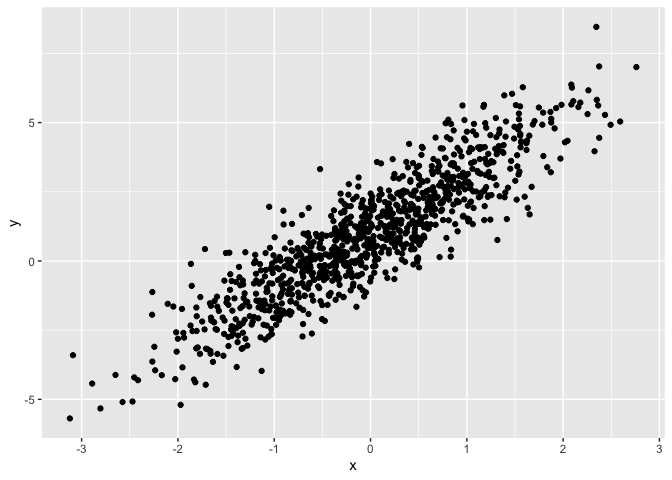

Simple document
================

I’m an R Markdown document!

# Section 1

Here’s a **code chunk** that samples from a *normal distribution*:

``` r
samp = rnorm(100)
length(samp)
```

    ## [1] 100

# Section 2

I can take the mean of the sample, too! The mean is 0.02.

# Section 3

## Plot from last time

This is going to make a plot! First I generate a dataframe, then use
`ggplot` to make a scatterplot.

``` r
plot_df = 
  tibble(
    x = rnorm(n = 1000),
    y = 1 + 2 * x + rnorm(n = 1000)
  )

ggplot(plot_df, aes(x = x, y = y)) + geom_point()
```

<!-- -->

# Section 4

The chunk below creates a dataframe containing a sample of size 500 from
a random normal variable, constructs the specified logical vector, takes
the absolute value of each element of that sample,and produces a
histogram of the absolute value. The code chunk also finds the median of
the sample and stores it for easy in-line printing.

``` r
library(tidyverse)

la_df = tibble(
  norm_samp = rnorm(500, mean = 1),
  norm_samp_pos = norm_samp > 0,
  abs_norm_samp = abs(norm_samp)
)

ggplot(la_df, aes(x = abs_norm_samp)) + geom_histogram()
```

    ## `stat_bin()` using `bins = 30`. Pick better value with `binwidth`.

<!-- -->

``` r
median_samp = median(pull(la_df, norm_samp))
```

The median of the variable containing absolute values is 1.08.
